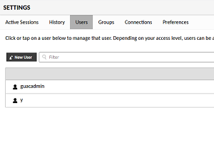

# ApacheGuacamole-Setup

Apache Guacamole を利用したリモートアクセス

---

## 経緯

1. いつものように[オープンソースカンファレンス](https://www.ospn.jp/osc2019-fall/)に参加したところ、**Apache Guacamole**の紹介セミナーを発見
1. 社内で実施しているモブプログラミング形式の勉強会で使えそう
1. 早速 Azure 上の VM(Windows Server 2019)に WSL を用意したうえで、Guacamole をインストールしてみた

## 構成

クライアント PC(Windows, Linux, Mac)上のモダンブラウザ → インターネット → Azure 仮想ネットワーク・NSG → Azure VM(Windows Server 2019) → WSL(Ubuntu 18.04) → Guacamole

## インストール手順

### MySQL

```sh
$ sudo apt update -y && sudo apt upgrade -y && sudo apt install mysql-server mysql-client -y

$ sudo service mysql start # 起動しておかないと初期化の際にエラーが発生する
$ sudo rm -rf /var/lib/mysql && sudo mysqld --initialize
$ grep 'temporary password' /var/log/mysql/error.log
```

初期仮パスワードを確認

```
2019-11-23T12:22:56.144754Z 1 [Note] A temporary password is generated for root@localhost: ************
```

初期パスワードから任意のパスワードに変更

```sh
$ sudo service mysql stop && sudo usermod -d /var/lib/mysql mysql && sudo service mysql start # 起動しておかないと初期設定の際にエラーが発生する
$ sudo mysql_secure_installation
```

ログインできることを確認

```sh
$ sudo mysql -u root -p
```

### Guacamole

[インストールスクリプト](https://github.com/MysticRyuujin/guac-install)を利用する。

```sh
$ wget https://git.io/fxZq5 && mv fxZq5 guac-install.sh && chmod +x guac-install.sh
$ sudo ./guac-install.sh --mysqlpwd *** --guacpwd ***
```

- guacadmin のパスワードを変更

- localhost 接続情報を作成


```
Protocol: RDP
Hostname: localhost
Port: 3389
Username: ***
Password: ***
```

読み書き / 読み取り専用のプロファイルを作成


権限弱めのユーザーを作成



(Azure NSG のポート開放と、)ファイアウォールの設定変更

 

クライアント PC から、[http://<domain>:8080/guancamole/](http://<domain>:8080/guancamole/)にアクセスし、サインインする

リモートデスクトップ接続の画面を表示している状態で`Ctrl+Alt+Shift`を押すと、メニューが表示される


必要に応じて、読み書き / 読み取り専用のプロファイルどちらかを選択し URL を発行、その URL を誰かに連携


") ") ")

---

Copyright (c) 2019 YA-androidapp(https://github.com/YA-androidapp) All rights reserved.
